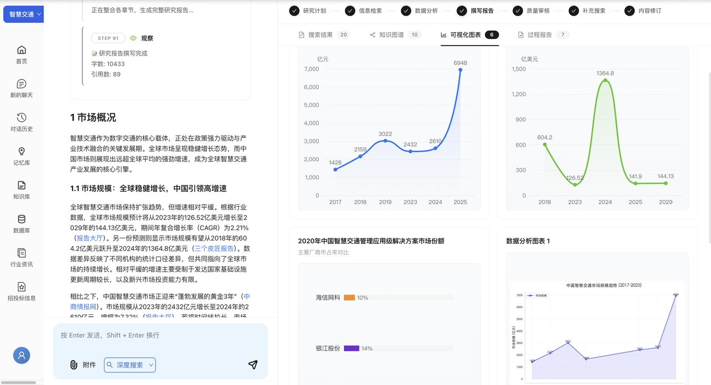

# 新能源汽车政策与产业信息分析助手

本项目是一个面向产业研究、企业分析、政策评估和技术趋势研判的多智能体深度研究系统。系统通过本地知识库、网络搜索、数据分析、代码沙箱和报告生成链路，将分散的信息源整合为可解释、可追溯、可视化的深度研究报告。

## 一、项目定位

### 1.1 项目概述

系统围绕“行业信息分析”这一核心任务构建，支持从用户问题出发，自动完成研究计划拆解、信息检索、数据提取、图表生成、报告撰写、质量审核和补充修订。与普通问答系统不同，本项目强调研究过程可见、引用来源可查、数据结论可解释，并通过多 Agent 协作提升报告质量。

### 1.2 应用场景

1. 行业研究报告生成

快速了解某个行业的市场规模、竞争格局和技术趋势，生成符合投行、咨询和产业研究场景的深度研究报告。

2. 企业竞争分析

分析特定企业的市场地位、业务模式和财务表现，支持横向对比多个竞争对手。

3. 政策影响评估

追踪政策变化对行业、企业和产业链的影响，辅助预测政策趋势和潜在机会。

4. 技术趋势研判

识别新兴技术的发展阶段，评估技术成熟度、商业化前景和产业落地风险。

## 二、核心能力拆解

### 2.1 多智能体协作架构

本项目采用 6 个专业 Agent 分工协作的模式，每个 Agent 各司其职，共同完成从研究规划到报告审核的完整流程。

| Agent 角色 | 英文名 | 核心职责 | 使用模型 |
| --- | --- | --- | --- |
| 总架构师 | ChiefArchitect | 问题分析、大纲规划 | deepseek v4 flash |
| 深度侦探 | DeepScout | 全网搜索、信息收集 | deepseek v4 pro |
| 数据分析师 | DataAnalyst | 数据提取、知识图谱构建 | deepseek v4 flash |
| 代码极客 | CodeWizard | 数据可视化、图表生成 | deepseek v4 flash |
| 首席笔杆 | LeadWriter | 报告撰写、内容整合 | deepseek v4 flash |
| 审核大师 | CriticMaster | 对抗式审核、质量把控 | deepseek v4 flash |

参考文件位置：`backend/app/service/deep_research_v2/agents/`

核心文件包括：`architect.py`、`scout.py`、`data_analyst.py`、`wizard.py`、`writer.py`、`critic.py`。

### 2.2 LangGraph 工作流编排

系统采用 LangGraph 构建状态机工作流，实现智能路由和循环审核机制。工作流会根据研究进度和审核反馈，决定是否进入补充搜索、数据分析、报告修订或最终输出阶段。

参考文件位置：`backend/app/service/deep_research_v2/graph.py`

关键特性：

- 条件路由：审核后智能判断是否需要补充搜索或修订。
- 状态持久化：全局状态在所有 Agent 间共享。
- 实时流式输出：通过 SSE 向前端推送研究进度。

### 2.3 全局工作记忆

所有 Agent 共享一个全局状态对象 `ResearchState`，用于沉淀研究过程中的大纲、事实、数据、图表、草稿、参考文献和审核反馈。

| 状态字段 | 数据类型 | 说明 |
| --- | --- | --- |
| `outline` | `List[Section]` | 动态研究大纲 |
| `facts` | `List[Fact]` | 结构化事实库，带可信度评分 |
| `data_points` | `List[DataPoint]` | 数据点集合 |
| `charts` | `List[Chart]` | 生成的可视化图表 |
| `draft_sections` | `Dict[str, str]` | 章节草稿 |
| `final_report` | `str` | 最终 Markdown 报告 |
| `references` | `List[Reference]` | 参考文献 |
| `critic_feedback` | `List[Feedback]` | 审核反馈 |
| `knowledge_graph` | `Dict` | 知识图谱 |

参考文件位置：`backend/app/service/deep_research_v2/state.py`

### 2.4 双模式信息检索

1. 网络搜索模式

- 搜索引擎：Bocha Web Search API。
- 深度阅读：使用 trafilatura 提取网页正文。
- 递归搜索：发现新线索后自动深挖。
- 信源评级：对来源进行可信度评分，范围为 0 到 1。

参考文件位置：`backend/app/service/deep_research_v2/agents/scout.py`

信源评分规则：

| 来源类型 | 可信度范围 |
| --- | --- |
| 官方来源，政府、央企等 | 0.9-1.0 |
| 学术来源，论文、研究机构等 | 0.8-0.95 |
| 权威媒体，央媒、财经媒体等 | 0.7-0.85 |
| 行业报告，券商、咨询机构等 | 0.7-0.9 |
| 一般新闻 | 0.5-0.7 |
| 自媒体 | 0.2-0.5 |

2. 本地知识库模式

- 向量检索：使用 Milvus 向量数据库。
- 语义搜索：基于阿里 `text-embedding-v4` 模型。
- 文档解析：支持 PDF、Word、Excel 等多种格式。
- 分块索引：智能文档分块，保留上下文信息。

参考文件位置：`backend/app/service/milvus_service.py`

### 2.5 数据分析与可视化

数据提取能力：

- 从非结构化文本中提取结构化数据点。
- 识别时间序列数据。
- 计算市场份额、增长率等关键指标。
- 对数据进行交叉验证和去重。

可视化生成能力：

- ECharts 图表：由 DataAnalyst 生成配置，前端直接渲染。
- Python 绘图：由 CodeWizard 执行 Python 代码生成 PNG 图片。
- 图表类型：折线图、柱状图、饼图、雷达图、桑基图和知识图谱。

参考文件位置：`backend/app/service/deep_research_v2/agents/data_analyst.py`

这些 Prompt 用于指导 LLM 从文本中提取数据、构建知识图谱并生成 ECharts 配置。

### 2.6 代码沙箱执行

CodeWizard Agent 拥有唯一的 Python 代码执行权限，用于数据分析和绘图。

安全机制：

- 白名单模式：只允许导入 pandas、numpy、matplotlib 等特定模块。
- 禁止列表：禁止文件操作、网络请求和系统调用。
- 隔离环境：在独立的全局作用域中执行代码。
- 自愈能力：执行失败时自动调用 LLM 修复代码。

参考文件位置：`backend/app/service/deep_research_v2/agents/wizard.py`

## 三、技术与数据底座

### 3.1 信息检索

- 网络检索：Bocha Web Search API。
- 网页正文抽取：trafilatura。
- 检索增强生成：结合网络搜索、本地知识库和多轮研究状态。

### 3.2 向量数据库

- 技术：Milvus 2.x。
- 嵌入模型：阿里 `text-embedding-v4`，1024 维。
- 存储方式：PostgreSQL 元数据与 Milvus 向量索引结合。

### 3.3 数据库与缓存

- 主数据库：PostgreSQL，用于用户、会话和知识库元数据。
- 缓存：Redis，用于检查点、会话状态和中间结果。

### 3.4 前后端交互

- 后端：FastAPI。
- 前端：React、Vite、Ant Design。
- 实时进度：通过 SSE 推送 Agent 执行阶段、检索状态、图表和报告内容。

## 四、关键设计原则

### 4.1 可解释性优先

- 所有结论必须带有来源引用。
- 数据点带可信度评分。
- 保留完整的执行日志和过程报告。

### 4.2 质量高于速度

- 通过审核和修订循环提升报告质量。
- 对关键信息进行多源验证。
- 拒绝生成无依据内容。

### 4.3 模块化与可扩展

- Agent 职责单一，便于替换和扩展。
- 状态机设计清晰，便于新增阶段。
- 支持新增数据源、工具和行业配置。

### 4.4 用户体验至上

- 实时展示研究进度。
- 支持中途取消和恢复。
- 提供可视化过程报告，帮助用户理解研究链路。
