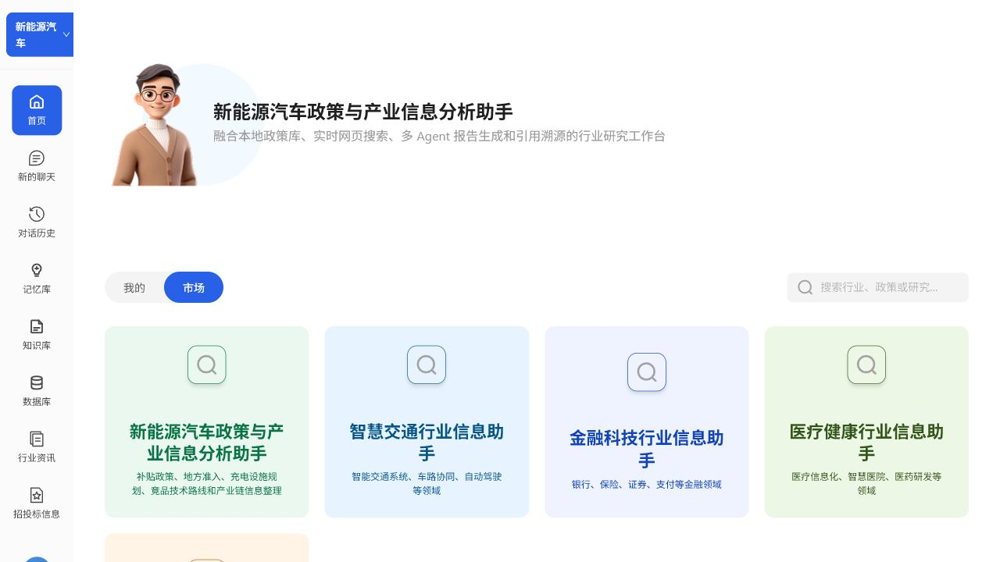
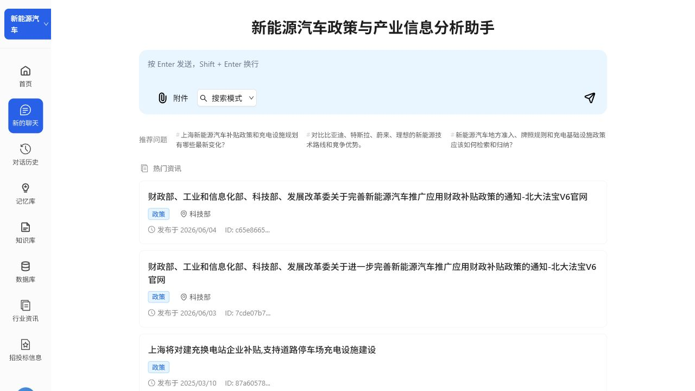
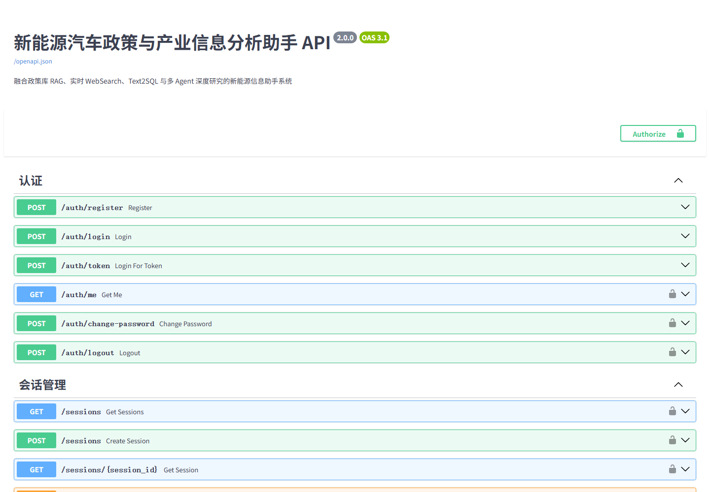

# 新能源汽车政策与产业信息分析助手 (NEV Policy & Industry Assistant)

一个基于 AI 的新能源汽车行业研究助手，面向补贴政策查询、地方准入规则对比、充电设施规划、竞品技术路线调研和产业链信息整理等场景。系统融合本地政策库 RAG、Bocha 实时网页搜索、Text2SQL、数据可视化和多 Agent 深度研究报告生成。

## 核心能力
- 新能源汽车政策库：按地区、发布时间、政策类型组织补贴、牌照、准入、充电设施和产业扶持信息。
- RAG 检索：使用 Milvus + DashScope Embedding 建立 1024 维向量库，支持文档切片、元数据过滤、TopK 召回和引用溯源。
- 实时 WebSearch：接入 Bocha Search，扩大召回后按来源质量、发布时间和去重策略筛选进入上下文。
- 多 Agent 报告：Architect / Scout / DataAnalyst / CodeWizard / Writer / Critic 协作完成规划、搜索、数据分析、图表生成、报告撰写和审核修订。
- 工程化交互：FastAPI + SSE 推送搜索、分析、写作、审核和 checkpoint 状态，React 前端展示过程、来源和图表。

## 目录
- [运行效果展示](#运行效果展示)
- [环境要求](#环境要求)
- [快速启动](#快速启动)
- [详细配置](#详细配置)
- [常见问题](#常见问题)

---

## 运行效果展示

以下截图来自本地完整运行验证：后端 FastAPI 运行在 `http://127.0.0.1:8000`，前端 Vite 运行在 `http://127.0.0.1:5173`。本机已有其他服务占用 `5432/6379`，所以本次运行将项目 PostgreSQL/Redis 分别映射到 `15432/16379`，Milvus 复用本地 `19530`。

### 应用首页

首页默认进入新能源汽车行业，突出“新能源汽车政策与产业信息分析助手”的项目定位，并保留可扩展的行业入口能力。



### 智能问答工作台

点击新能源汽车卡片后进入聊天工作台，页面展示新能源政策与产业分析的推荐问题、搜索模式、附件入口和热门资讯，可用于补贴政策查询、地方准入规则归纳、竞品技术路线对比和产业链信息整理。



### 后端 API 文档

后端 OpenAPI 文档已更新为新能源项目语义，包含认证、会话、知识库、文档、搜索、资讯、招投标和深度研究等接口，便于联调和功能展示。



---

## 环境要求

| 依赖 | 版本要求 | 说明 |
|------|---------|------|
| Docker | 20.0+ | 运行所有基础服务（PostgreSQL、Redis、Milvus、Elasticsearch） |
| Python | 3.10+ | 后端服务 |
| Node.js | 18+ | 前端构建 |

---

## 快速启动

### 1. 下载项目
```bash
cd industry_information_assistant
```

### 2. 一键启动所有基础服务 (推荐)

**方式 A: 使用启动脚本（推荐）**
```bash
# 在项目根目录执行
chmod +x start-services.sh
./start-services.sh start
```

**方式 B: 使用 Docker Compose**
```bash
# 在项目根目录执行
docker compose up -d
```

验证服务状态：
```bash
# 方式 A
./start-services.sh status

# 方式 B
docker compose ps

# 应该看到以下服务运行中:
# - industry_postgres (PostgreSQL)
# - industry_redis (Redis)
# - industry_milvus (Milvus)
# - industry_elasticsearch (Elasticsearch)
# - industry_minio (MinIO)
# - industry_etcd (etcd)
```

**服务访问地址：**
- PostgreSQL: `localhost:5432` (用户名: `postgres`, 密码: `postgres123`)
- Redis: `localhost:6379`
- Milvus: `localhost:19530`
- Elasticsearch: `localhost:1200`
- MinIO Console: `localhost:9001` (admin/minioadmin)

**端口冲突时的本地运行方式：**

如果 `5432` 或 `6379` 已被其他服务占用，可以单独启动项目数据库和缓存，并在启动后端前覆盖端口：

```powershell
docker run -d --name industry_postgres -e POSTGRES_USER=postgres -e POSTGRES_PASSWORD=postgres123 -e POSTGRES_DB=industry_assistant -p 15432:5432 postgres:15-alpine
docker run -d --name industry_redis -p 16379:6379 redis:7-alpine redis-server --appendonly yes

$env:POSTGRES_PORT='15432'
$env:REDIS_PORT='16379'
python app/app_main.py
```

### 3. 配置环境变量

```bash
cd backend

# 复制示例配置文件
cp .env.example .env

# 编辑 .env 文件，填入你的 API Key
```

**必填的 API Key（其他配置已预配置好）：**
```env
# 阿里云百炼 (LLM & Embedding) - 必填
DASHSCOPE_API_KEY=your-dashscope-api-key

# 搜索服务 - 必填
BOCHA_API_KEY=your-bocha-api-key

# PostgreSQL 配置（已在 Docker 中配置，通常无需修改）
POSTGRES_HOST=localhost
POSTGRES_PORT=5432
POSTGRES_USER=postgres
POSTGRES_PASSWORD=postgres123
POSTGRES_DB=industry_assistant

# JWT 密钥（生产环境建议修改）
JWT_SECRET_KEY=your-super-secret-key-change-in-production
```

**注意：**
- PostgreSQL、Redis、Milvus 的配置已在 Docker Compose 中设置好
- `.env.example` 文件中的默认值与 Docker 配置匹配
- 如果使用 Docker，数据库相关配置**通常无需修改**
- 生产环境务必修改 `JWT_SECRET_KEY` 为随机密钥

### 4. 安装后端依赖 & 启动

```bash
cd backend

# 创建虚拟环境 (推荐)
conda create -n deepresearch python=3.10
conda activate deepresearch

# 安装依赖
pip install -r requirements.txt

# 启动后端服务
python app/app_main.py
```

后端默认运行在 `http://localhost:8000`

### 5. 安装前端依赖 & 启动

```bash
cd frontend

# 安装依赖
npm install --legacy-peer-deps

# 开发模式启动
npm run dev
```

前端默认运行在 `http://localhost:5173/login`

---

## 详细配置

### 环境变量说明

#### 必填配置

| 变量名 | 说明 | 申请地址 |
|--------|------|----------|
| `DASHSCOPE_API_KEY` | 阿里云百炼 (LLM & Embedding) | https://bailian.console.aliyun.com/ |
| `BOCHA_API_KEY` | 博查搜索 API | https://open.bochaai.com/ |
| `POSTGRES_*` | PostgreSQL 连接配置 | - |
| `REDIS_HOST/PORT` | Redis 连接配置 | - |
| `MILVUS_HOST/PORT` | Milvus 向量数据库配置 | - |
| `JWT_SECRET_KEY` | JWT 认证密钥 (自定义字符串) | - |

#### 其它配置

| 变量名 | 说明 | 申请地址 |
|--------|------|----------|
| `DOCMIND_ACCESS_KEY_ID` | 阿里云 DocMind 文档解析 | https://help.aliyun.com/zh/ram/user-guide/create-an-accesskey-pair |
| `DOCMIND_ACCESS_KEY_SECRET` | 阿里云 DocMind Secret | 同上 |
| `BID_APP_KEY` | 招投标信息 API | https://market.aliyun.com/detail/cmapi00063550?spm=5176.730005.result.20.3188414aM3Wls9&innerSource=search_%E6%8B%9B%E6%8A%95%E6%A0%87#sku=yuncode5755000002 |
| `BID_APP_SECRET` | 招投标 API Secret | 同上 |
| `BID_APP_CODE` | 招投标 API Code | 同上 |
| `JUHE_STOCK_API_KEY` | 聚合数据 - 股票行情 | https://www.juhe.cn/docs/api/id/21 |
| `OPENROUTER_API_KEY` | OpenRouter (多模型网关) | https://openrouter.ai/ |


### 高级部署选项

#### 使用本地 PostgreSQL（不推荐新手）

如果你想使用本地安装的 PostgreSQL 而不是 Docker：

1. **安装 PostgreSQL**
   ```bash
   # macOS
   brew install postgresql@15
   brew services start postgresql@15
   ```

2. **创建数据库和用户**
   ```bash
   # 连接 PostgreSQL
   psql postgres

   # 创建用户
   CREATE USER postgres WITH PASSWORD 'postgres123';

   # 创建数据库
   CREATE DATABASE industry_assistant OWNER postgres;

   # 退出
   \q
   ```

3. **修改 Docker Compose 配置**
   ```bash
   # 编辑 docker-compose.yml，注释掉 postgres 服务
   # 或者使用 backend/docker-compose-base.yml（只包含 Redis 和 Milvus）
   cd backend
   docker compose -f docker-compose-base.yml up -d
   ```

4. **确保 `.env` 配置正确**
   ```env
   POSTGRES_HOST=localhost
   POSTGRES_PORT=5432
   POSTGRES_USER=postgres
   POSTGRES_PASSWORD=postgres123
   POSTGRES_DB=industry_assistant
   ```

### 数据库初始化

首次启动时，后端会自动创建数据库表。如果遇到问题，可手动执行：

```sql
-- 连接数据库
-- Docker: docker exec -it industry_postgres psql -U postgres -d industry_assistant
-- 本地: psql -U postgres -d industry_assistant

-- 确保 research_checkpoints 表有完整的列
ALTER TABLE research_checkpoints ADD COLUMN IF NOT EXISTS ui_state_json JSONB;
ALTER TABLE research_checkpoints ADD COLUMN IF NOT EXISTS final_report TEXT;
```

### 服务管理

#### 使用启动脚本（推荐）

```bash
# 启动所有服务
./start-services.sh start

# 查看服务状态
./start-services.sh status

# 查看日志
./start-services.sh logs              # 所有服务
./start-services.sh logs postgres     # 特定服务

# 重启服务
./start-services.sh restart

# 停止服务
./start-services.sh stop

# 清理数据（危险操作！）
./start-services.sh clean
```

#### 使用 Docker Compose

```bash
# 启动
docker compose up -d

# 查看状态
docker compose ps

# 查看日志
docker compose logs -f
docker compose logs -f postgres    # 特定服务

# 停止
docker compose down

# 停止并删除数据卷（危险操作！）
docker compose down -v
```

### 上传测试文档 (可选)

```bash
cd backend
curl -X POST "http://localhost:8000/documents/upload" \
  -H "Content-Type: multipart/form-data" \
  -F "file=@./test/test_doc.pdf"
```

---

## 常见问题

### Q: Docker 容器启动失败？
```bash
# 使用启动脚本查看状态
./start-services.sh status

# 查看具体服务日志
./start-services.sh logs postgres    # 查看 PostgreSQL 日志
./start-services.sh logs             # 查看所有服务日志

# 重启所有容器
./start-services.sh restart

# 或使用 Docker Compose
docker compose down
docker compose up -d
```

### Q: 后端连接数据库失败？
**常见原因：**
1. Docker 服务未启动
   ```bash
   ./start-services.sh status   # 检查服务状态
   ./start-services.sh start    # 启动服务
   ```

2. `.env` 文件配置错误
   ```bash
   # 确保配置与 Docker 一致
   POSTGRES_USER=postgres
   POSTGRES_PASSWORD=postgres123
   POSTGRES_DB=industry_assistant
   ```

3. 端口被占用（如已安装本地 PostgreSQL）
   ```bash
   # 停止本地 PostgreSQL（如果有）
   brew services stop postgresql
   # 或者修改 docker-compose.yml 中的端口映射
   ```

### Q: 前端 npm install 报错？
```bash
# 使用 legacy-peer-deps 解决依赖冲突
npm install --legacy-peer-deps

# 或清除缓存后重试
rm -rf node_modules package-lock.json
npm install --legacy-peer-deps
```

### Q: 研究历史无法恢复右侧面板数据？
执行数据库迁移：
```sql
ALTER TABLE research_checkpoints ADD COLUMN IF NOT EXISTS ui_state_json JSONB;
ALTER TABLE research_checkpoints ADD COLUMN IF NOT EXISTS final_report TEXT;
```
然后重启后端服务。

---

## 项目结构

```
industry_information_assistant/
├── backend/
│   ├── app/
│   │   ├── api/          # API 路由
│   │   ├── core/         # 核心配置
│   │   ├── models/       # 数据模型
│   │   ├── service/      # 业务逻辑
│   │   └── app_main.py   # 入口文件
│   ├── docker-compose-base.yml
│   ├── requirements.txt
│   └── .env
├── frontend/
│   ├── src/
│   │   ├── api/          # API 调用
│   │   ├── components/   # 组件
│   │   ├── pages/        # 页面
│   │   └── store/        # 状态管理
│   └── package.json
└── READMED.md
```

---

## API 文档

启动后端后访问：`http://localhost:8000/docs`
